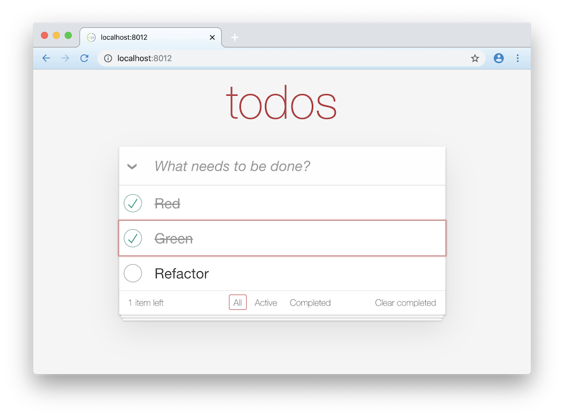
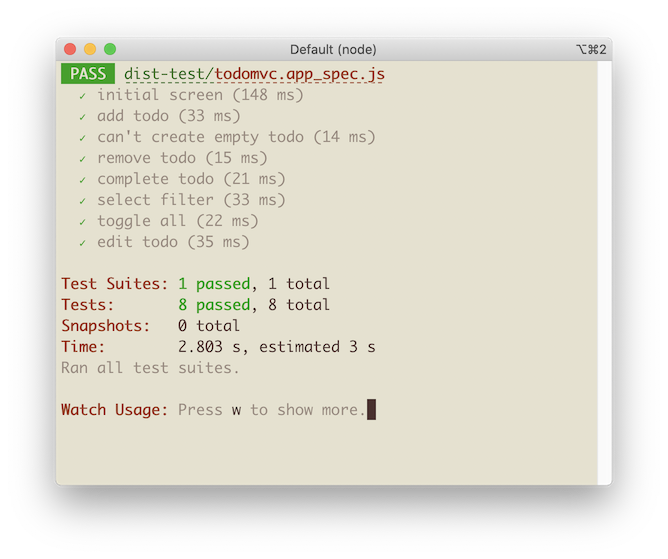

# shadow-jest



Shadow-jest is a demo app written for ClojureScript with shadow-cljs, Jest and the excellent [React Testing Library](https://testing-library.com/docs/react-testing-library/intro/). It is intended to demonstrate the feasibility of Test Driven Development (TDD) using component testing in ClojureScript.

Test Driven Development as [defined by Martin Fowler](https://martinfowler.com/bliki/TestDrivenDevelopment.html) means cycling through three steps:

- Write a test for the next bit of functionality you want to add.
- Write the functional code until the test passes.
- Refactor both new and old code to make it well structured.

Following TDD is generally hard to do well in frontend development but — as I'm slowly realizing, after many years — it's worth it because it tends to improve internal software quality and, just as importantly, it allows you to take [many more, much smaller steps](https://gist.github.com/pesterhazy/00ec5886e0378a83e5bf4ad96cfaaf65).

As a matter of fact, with the advent of React Testing Library (and previously Enzyme), component tests have now emerged as a significant category of tests alongside traditional microtests or unit tests on the one side and end-to-end tests on the other.

Note that I don't think component tests can replace microtests or unit tests. Wherever you can extract business logic (conditional branching logic in Geepaw Hill's phrase) into a namespace, function, class or some other abstraction, making it into something that can be tested gracefully (rather than awkwardly) and in isolation (rather than in a tightly coupled way), then that's what you should do.

However, in practice React component tend to contain a fair amount of business logic, so it's great to have a way to test that. The downside is that component tests, while multiple orders of magnitude faster and more reliable than end-to-end-tests, are still not as fast as we would like (at 10-50ms per test) to get the fast feedback we need for TDD. So as developers, we still need to work to improve our architecture to make it testable using traditional microtests. As it turns out, for microtests, which typically run very fast (<5ms), Jest is also a great tool, because it can parallelize test execution.

## Why Jest?

Jest is a state-of-the-art test runner, much better than anything available for ClojureScript. It makes integration with jsdom and React Testing Library easy and supports parallel test runs in node.



It's often thought that ClojureScript should be tested by using tools that are native to the Clojure community. But using Jest, arguably JavaScript's most popular testing tool, allows you to take advantage of the many advances that frontend testing has made in the last decade, including:

- Great support for asynchronous tests
- Isolating test runs using `test.skip` and `test.only`
- Running code in node rather than the browser
- Fake timers and mocking support
- Integration with jsdom
- Integration with React Testing Library

Jest uses a fluent-style DSL

```
test("reverse", () => {
  expect(reverse("Quark")).toBe("krauQ");
}
```

which translates to

```
(js/test "reverse"
         (fn []
           (-> (js/expect (clojure.string/reverse "Quark"))
               (.toBe "krauQ"))))
```

Perhaps this is (subjectively) inferior to JUnit style assertions, but it's not hard to get over this initial hurdle.

## Why UIx?

[UIx](https://github.com/roman01la/uix) is a delightful modern React wrapper. As its syntax, it uses Reagent-flavored hiccup, a.k.a. the magnificent sexp-based DSL that HTML could've been. It's modern because it exposes React primitives like useEffect, useState and useRef, which ClojureScript-land is only now catching up to.

## Usage

```
# Start the compilation
npm run dev

# Run the tests first - we're doing TDD after all
npm run test

# Optionally (!) check what it actually looks like in the browser
open http://localhost:8012/
```

## About TodoMVC

[TodoMVC](https://todomvc.com/) is, by convention, the Hello World 2.0 of frontend applications, and it's been around for years. The app has just enough state to warrant a framework like React. This kata brings us the joy of building a frontend app [with an existing specification](https://github.com/tastejs/todomvc/blob/master/app-spec.md) without worrying about the [CSS](https://unpkg.com/todomvc-app-css@2.4.1/index.css). We can focus only on the logic - and, of course, on the tests!

Check out [an example written in pure React](https://todomvc.com/examples/react/#/)

## Author

Paulus Esterhazy pesterhazy@gmail.com — feedback welcome!
